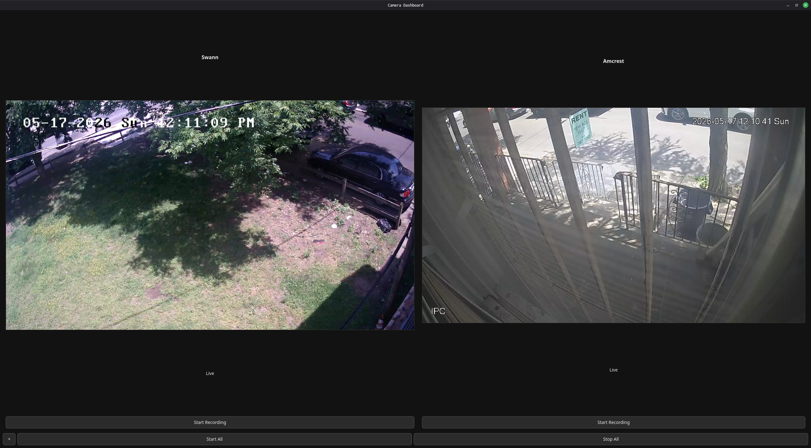
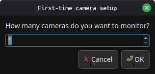
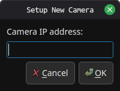

# PyQt Camera Dashboard


A multi-camera RTSP dashboard built with Python, OpenCV, and PyQt5.

Monitor, record, and manage multiple IP cameras from a single dark-theme GUI. Camera credentials are stored in an encrypted config file — nothing sensitive is ever saved in plaintext.

---

## Main Dashboard



---

## First-Time Setup



---

## Add Camera Dialog



---

## Features

### First-Time Setup Wizard
On first launch a PyQt dialog walks you through adding your cameras:
- Camera IP address
- Display name
- Username
- Password (masked during entry)

The app creates `camera_config.json` and encrypts it automatically. You are never prompted to configure files manually.

---

### Camera Tile Controls
Each camera tile has its own controls:

| Button | What it does |
|---|---|
| Start / Stop Recording | Toggles recording for that camera only |
| Reconnect | Manually reconnects that camera without restarting the app |
| Remove | Removes the tile from the current session (does not delete from config) |

---

### Dashboard Controls

| Button | What it does |
|---|---|
| + | Opens the add-camera dialog to add a new camera while the app is running |
| Start All | Starts recording on all active cameras |
| Stop All | Stops recording on all active cameras |

---

### Encrypted Credential Storage
Camera credentials are never stored in plaintext. On first run the app generates a `secret.key` file beside the script. Every save operation writes JSON and immediately encrypts it with Fernet (AES-128). On load it decrypts before reading.

**Keep `secret.key` private. Do not upload it to GitHub. Without it the config cannot be decrypted.**

---

### Automatic Reconnect
Each camera worker runs in its own background thread. If a stream drops, the worker retries automatically up to 3 times. After 3 failures the tile shows **Camera Offline** and enables the Reconnect button so you can retry manually without restarting the dashboard.

---

### Recording
- Recordings are split into 15-minute segments automatically
- Files are named: `cameraname_YYYY-MM-DD_HH-MM-SS.mp4`
- Organized on disk by date and hour
- Duplicate camera names are handled — each camera gets a unique filename prefix

---

### Automatic Disk Cleanup
When disk usage on the recordings drive exceeds 75%, the app deletes the oldest recordings automatically until usage drops back to a safe level. No manual cleanup needed.

---

### Recording Storage Structure

```text
recordings/
└── YYYY-MM-DD/
    └── HH/
        └── cameraname_YYYY-MM-DD_HH-MM-SS.mp4
```

---

## Installation

### Linux / Ubuntu

```bash
sudo apt update
sudo apt install python3 python3-pip python3-venv git
```

```bash
git clone https://github.com/BleedingCodes/pyqt-camera-dashboard.git
cd pyqt-camera-dashboard
```

```bash
python3 -m venv venv
source venv/bin/activate
```

```bash
pip install -r requirements.txt
```

```bash
python camera_dashboard.py
```

---

### Windows

```powershell
git clone https://github.com/BleedingCodes/pyqt-camera-dashboard.git
cd pyqt-camera-dashboard
```

```powershell
py -m venv venv
venv\Scripts\activate
```

```powershell
pip install -r requirements.txt
```

```powershell
python camera_dashboard.py
```

---

## First-Time Launch

On first launch the app will:

1. Generate `secret.key` in the script folder
2. Open the setup wizard to collect your camera details
3. Save and encrypt `camera_config.json`

On every launch after that it decrypts and loads your cameras automatically.

---

## Security

| File | Purpose | Upload to GitHub? |
|---|---|---|
| `secret.key` | Encryption key | **Never** |
| `camera_config.json` | Encrypted camera credentials | **Never** |
| `recordings/` | Video files | **Never** |

Both files are listed in `.gitignore`. Do not remove them from `.gitignore`.

---

## Requirements

```text
PyQt5
opencv-python
cryptography
```

Install with:

```bash
pip install -r requirements.txt
```

---

## Compatibility

| Item | Requirement |
|---|---|
| Python | 3.10 or higher |
| Camera protocol | RTSP |
| Tested camera format | `rtsp://user:pass@ip:554/cam/realmonitor?channel=1&subtype=0` |
| OS | Linux (Ubuntu/Debian), Windows 10/11 |

---

## Future Improvements

- Motion detection alerts
- H.265 / HEVC support
- PTZ camera controls
- Web-based remote dashboard
- GPU-accelerated decoding
- Docker support
- Multi-monitor layout

---

## License

MIT License
